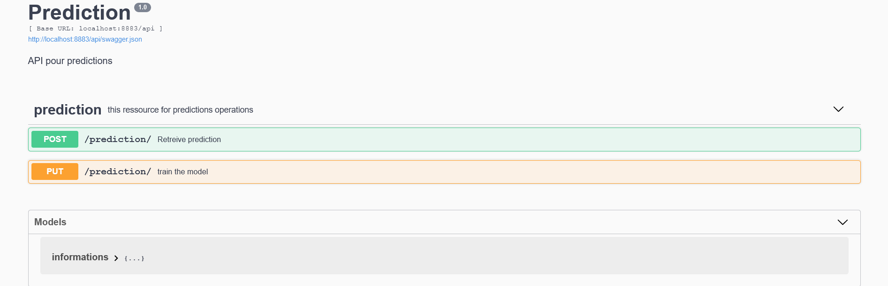
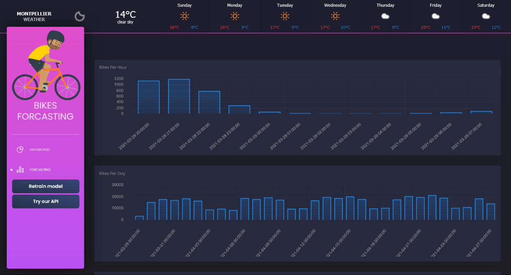
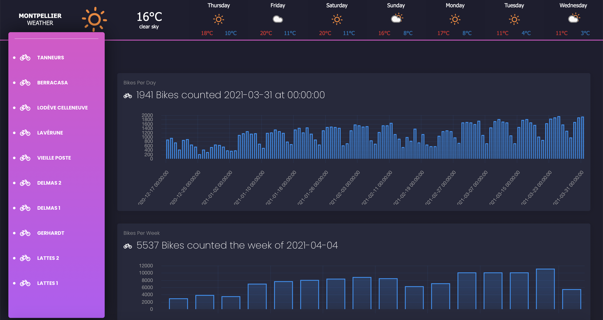
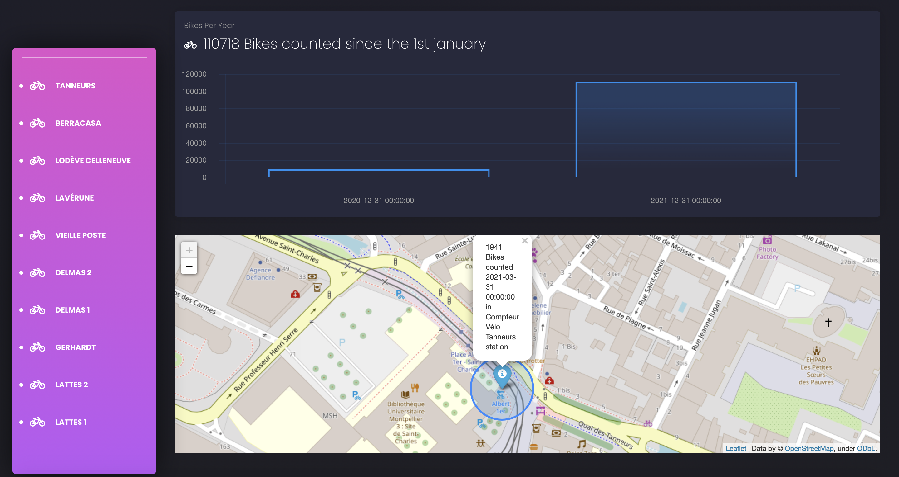

# Bikes Challenge
## Description
This repository provides the source code of the bikes number prediction challenge. The prediction part shows the implementation of our predictive project based on the data from:

> https://docs.google.com/spreadsheets/d/e/2PACX-1vQVtdpXMHB4g9h75a0jw8CsrqSuQmP5eMIB2adpKR5hkRggwMwzFy5kB-AIThodhVHNLxlZYm8fuoWj/pub?gid=2105854808&single=true&output=csv, 

while the visualization part is implemented as a web application. using the daily data from : 
> http://data.montpellier3m.fr/dataset/comptages-velo-et-pieton-issus-des-eco-compteurs/resource/75f5e367-99fb-482f-ba5c 

to visualize the bike traffic in Montpellier.
## Features

**1. Prediction part:**
- Daily trained predictive model based on Prophet library
- API that allows sending the data and receiving predictions with time units
- Dashboard that visualizes the recent data and future prediction evolution over the time

**2. Visualization part:**
- Dashboard that visualizes the recent registered data of each bikes station
- Map displaying the station's position
- Weather forcasting

## Codebase structure
**1. Web appplication:**
```bash
< PROJECT ROOT >
   |
   |-- app/                      # Implements app logic
   |    |-- base/                # Base Blueprint 
   |    |-- home/                # Home Blueprint - web app pages & backend data preparation |                              (visualized data and prediction)
   |    |
   |   __init__.py               # Initialize the app
   |
   |-- requirements.txt          # Development modules 
   |
   |-- config.py                 # Set up the app
   |-- run.py                    # Start the app 
```

**2. API**
```bash
< PROJECT ROOT >
   |
   |-- api/                       # Implements app logic
   |    |-- Ressources/             
   |      | -- endpoints          # Exposed interface implementation
   |        | -- prediction.py    
   |      | -- operations.py      # Data preparation for visualization and Prophet model
   |      | -- serializers.py     # Data object serialization
   |      | -- __init__py
   |    |-- restplus.py          
   |    |-- __init__.py
   |   __init__.py               # Initialize the app
   |
   |-- settings.py               # Set up the app
   |-- app.py                    # Start the app 
```   
## How to use it
This project is composed of two main parts:
- The prediction part: In which we build a predictive model using fbprophet library Prophet, expose the prediction feature using the API and visualize data and prediction.
#### API
```bash
$ conda env create --file environment.yml
$ cd API_prediction
$ conda install --file requirements.txt
$ python app.py
```
The base API url is http://127.0.0.1:8883/api. You can overwrite the IP adress and the port in setting.py file, and the prefixe (/api) in the app.py file.

#### Dashboard
```bash
$ conda env create --file environment.yml
$ cd Dashboard
$ conda install --file requirements.txt
$ python run.py
```
The web application url is http://127.0.0.1:5000/.

**Prediction dashboard**


**Visualization dashboard**



This dashboard is based on : https://appseed.us/admin-dashboards/flask-dashboard-black

